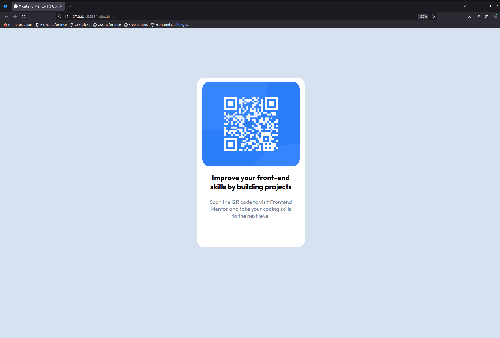

# Frontend Mentor - QR code component solution

This is a solution to the [QR code component challenge on Frontend Mentor](https://www.frontendmentor.io/challenges/qr-code-component-iux_sIO_H). Frontend Mentor challenges help you improve your coding skills by building realistic projects. 

## Table of contents

  - [Overview](#overview)
  - [Screenshot](#screenshot)
  - [Links](#links)
  - [My process](#my-process)
  - [Built with](#built-with)
  - [What I learned](#what-i-learned)
  - [Continued development](#continued-development)
  - [Useful resources](#useful-resources)
  - [Author](#author)
  - [Acknowledgments](#acknowledgments)

**Note: Delete this note and update the table of contents based on what sections you keep.**

## Overview

### Screenshot

### Links

- Solution URL: [Add solution URL here](https://your-solution-url.com)
- Live Site URL: [Add live site URL here](https://your-live-site-url.com)

## My process

### Built with

- Semantic HTML5 markup
- CSS custom properties
- Flexbox
- CSS Grid
- Mobile-first workflow

### What I learned

I learned the correct ussage of nth-child on css elements, I wasn't able to perform anything like this before.

### Continued development

I'm focused on frontend development, I'd like to keep my development on HTML, CSS and JavaScript, resolving challenges
and creating new pages.

## Author

- Website - [https://github.com/ErnestoGLechuga]
- Frontend Mentor - [@ErnestoGLechuga](https://www.frontendmentor.io/profile/ErnestoGLechuga)
- Twitter - [@Bicerya_](https://www.twitter.com/Bicerya_)

## Acknowledgments

Thanks for reading the code and taking the opportunity to give feedback on the project. I'm very newbie on this, however I will do my best to assure that every challenge is completed before the end of the firts half of 2023. 
Reach me on Twitter if you have any questions or suggestions.

